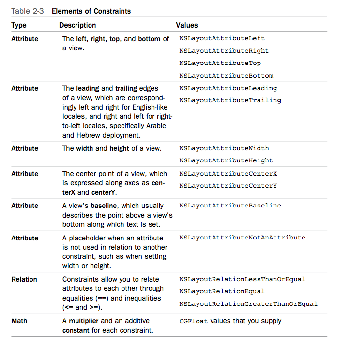

Auto Layout Part One 
===============
---

Week 3 - Day 1 - Lesson 3

By: Eric Giannini 

---

# CONNECTION TO LONG-TERM OBJECTIVE

Replacing the historical springs & struts model, Auto Layout, a tool for developing adaptive layouts, that provides a visual representation of layout, as opposed to programmatic views. 

# LEARNING OBJECTIVES

* **Articulate** the purpose of Auto Layout

* **Cover** each of the tools, Pin, Align, & Resolver; & errors 

* **Iterate** on a simple layout with Auto Layout

## STUDENT PRE-WORK

Students should know:

* Xcode
* Document Outline
* View Hierarchy 

# LESSON GUIDE

<table>
  <tr>
    <td>TIMING</td>
    <td>TYPE</td>
    <td>TOPIC</td>
  </tr>
  <tr>
    <td>10</td>
    <td>Opening</td>
    <td>Solve this problem</td>
  </tr>
  <tr>
    <td>15</td>
    <td>Introduction </td>
    <td>Constraints</td>
  </tr>
  <tr>
   	<td>15</td>
   	<td>Write - Pair - Share</td>
   	<td>The Equation & One View</td>
  </tr>
  <tr>
    <td>10</td>
    <td>Independent Practice</td>
    <td>Two Views</td>
  </tr>
    <tr>
    <td>15</td>
    <td>Pair Programming</td>
    <td>Three Views</td>
  </tr>
  <tr>
    <td>5</td>
    <td>Conclusion</td>
    <td>Key takeaways</td>
  </tr>
</table>

# OPENING (10 mins)
What is Auto Layout?  

## PRACTICE PROBLEM

Try to create a layout.

---

## Definition 

The layout of your view hierarchy is defined as a series of linear equations. Each constraint represents a single equation. Your goal is to declare a series of equations that has one and only one possible solution.

Auto Layout dynamically calculates the size and position of all the views in your view hierarchy, based on constraints placed on those views. 

* relational ( relationship of one view to another)
* hierarchical (i.e., superview, view, subview)
* visual (i.e., pin, align, resolve)
* attributive (i.e., leading, trailing, top, & bottom)

> Note: Constraints can also define the relationship between two different attributes of a single item, for example, setting an aspect ratio between an item’s height and width, and this makes these constraints relational. 

# INTRODUCTION: Anatomy of Constraints (15 mins)

“We call the relations between views constraints”

Excerpt From: Steven Lipton. “Practical Autolayout Xcode 8.” MakeAppPie.com, 2016. iBooks. https://itun.es/us/5233fb.l

## STOP-AND-JOT

Create a scene from a Document Outline in Xcode; inside of the scene, drag & drop a label. Stop and jot and describe constraints to keep the label centered horizontally & vertically inside of the scene. What would the equation look like? 

## DEFINITION

A constraint is an equation. Each constraint represents a single equation.

- Item 1. The first item in the equation—in this case, the red view. The item must be either a view or a layout guide.
- Attribute 1. The attribute to be constrained on the first item—in this case, the red view’s leading edge.
- Relationship. The relationship between the left and right sides. The relationship can have one of three values: equal, greater than or equal, or less than or equal. In this case, the left and right side are equal.
- Multiplier. The value of attribute 2 is multiplied by this floating point number. In this case, the multiplier is 1.0.
- Item 2. The second item in the equation—in this case, the blue view. Unlike the first item, this can be left blank.
- Attribute 2. The attribute to be constrained on the second item—in this case, the blue view’s trailing edge. If the second item is left blank, this must be Not an Attribute.
- Constant. A constant, floating-point offset—in this case, 8.0. This value is added to the value of attribute 2.

Excerpt From: Apple's Documentation. 

## The Equation

_view1.attribute (relation) view2.attribute * multiplier + constant_

## Write - Pair - Share 

+ Open the [oneObjectLayout](https://git.generalassemb.ly/iosi/sf-01-materials-and-lessons/tree/master/week-03/Lessons/auto-layout-lessons/oneObjectLayout) project
+ Examine the four constraints on the `UITableView` object in the `UIViewController`'s scene in `Main.storyboard`.
+ Write out the equations for each of these constraints. 
+ Compare these equations to you `Stop & Jot` equations.
+ Explain what is the relation for each of the constraints. 
+ Are these attributive constraints? 
+ Move the `UITableView` object with the __Size Inspector__ into the upper right hand corner, taking a screenshot
+ Move the `UITableView` object with the __Size Inspector__ into the lower right hand corner, taking a screenshot
+ Move the `UITableView` object with the __Size Inspector__ into the lower left hand corner, taking a screenshot
+ + Move the `UITableView` object with the __Size Inspector__ into the upper left hand corner, taking a screenshot

## How do I define these equations without math? 

The Pin, Align, & Resolver! 

## Pin

Pin is a type of constraint for the size and space between views, usually neighbor views. These we call pins.

### Spacing to nearest neighbor

You can set the space to the nearest neighbor in South, North, East, & West. 

### Spacing for Width & Height

You can set the width & height. 

### Equal Widths, Heights, Ratio

You can set Equal Widths, Heights, & an aspect ratio to keep a proportional size for a single control. 

### Update your frames & Add Constraints

You can add your constraints or update frames. 

## Align 

The other is between two specific views by an attribute of the view. These we call alignment or aligns.

### New Alignment Constraints 

What is an edge? 

- leading 
- trailing
- top
- bottom 

What is a center? 

- horizontal
- vertical
- baseline

### Container 

What is the container (i.e., superview)?

- horizontally
- vertically 

## Resolver 

Besides aligns and pins, you will need to update and resolve changes to the constraints with resolvers. At the bottom of the storyboard, you will find a few buttons that make your auto layout changes.

## Rules of the Game

Auto Layout is a game that can be fun; satisfying all constraints in Auto Layout requires knowledge of the rules of the game. The rules of the game state that you cannot have views whose constraints are:

* misplaced
* ambiguous
* conflicting 

### misplaced views

Misplaced or improperly sized views have the correct constraints but are not in the place they will display at runtime. A solution is to update frames. 

### missing constraints

A missing constraint, sometimes referred to as an ambiguous constraint, results when the constraints have insufficient information to determine the location & size of a view. A solution is to add constraints. 

### conflicting constraints

A conflicting constraint is when two or more views have constraints that force the views to be in the same place at the same time. 

## DEMONSTRATE

Force errors to understand rules of the game; take a screenshot with Option + Command + 4. Share each of these errors live with class. 

# INDEPENDENT PRACTICE (10 mins)

## PRACTICE PROBLEMS

* Create a layout with two views each of which violates the "the Rules of the Game"

* Use the resolver to solve these problems. 

* Take note of the logic you used to resolve violations of "the Rules of the Game".

# PAIR-PROGRAMMING PRACTICE (15 mins)

## PRACTICE PROBLEMS

* Add a third view to the previous layout.

* Note all of the violations of the Rules of the Game. 

* Resolve all of the violations for the three views.

* Build and run the program's layout.

---

# CONCLUSION (5 mins)

## CHECK-FOR-UNDERSTANDING: WRITE-SHARE

*Write down what you think is the purpose of a constraint is.*

## TAKEAWAYS

* Constraints are relational.  

* Auto Layout is a visual repreation of constraints. 

## Further Reading 

- [Cocoa Release Notes on Auto Layout](https://developer.apple.com/library/content/releasenotes/UserExperience/RNAutomaticLayout/index.html#//apple_ref/doc/uid/TP40010631)

- [AstroLayout](https://developer.apple.com/library/content/samplecode/AstroLayout/Introduction/Intro.html#//apple_ref/doc/uid/TP40016193)

