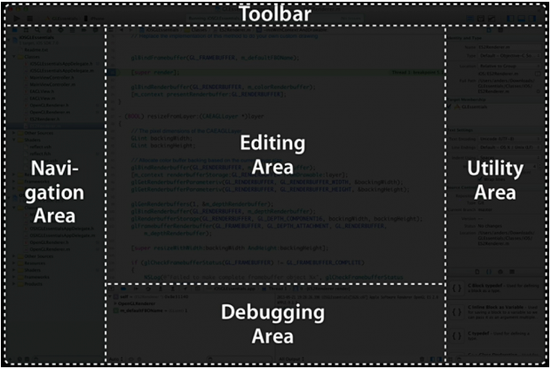
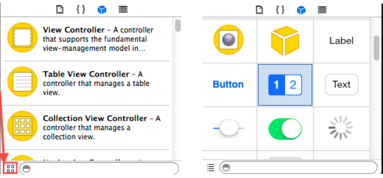
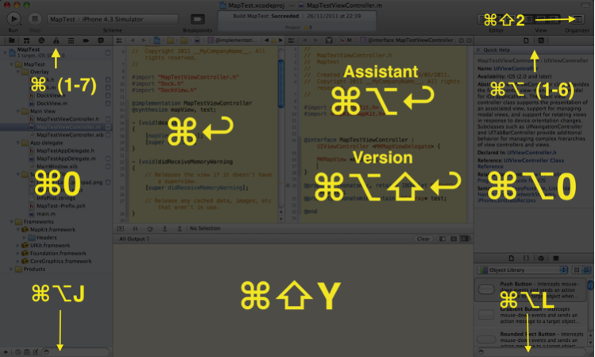

#  intro to Xcode

## 

Welcome to General Assembly's intro to Xcode.  

## The topics we will cover are:

 - Run!
 - Documentation
 - Xcode
 - Xcode keyboard shortcuts 
 - Languages
 

## By the end of this lesson, we should be able to (i.e., Learning Objectives):
 * Explore documentation
 * Run an app with a single keystroke  
 * Control over navigators, inspectors or areas in Xcode 
 * Compare / contrast the basics of Objective-C vis-a-vis Swift

# RUN!!!
`⌘r`

#### Documentation 

To open the Documentation window, choose Window > Documentation and API Reference.

## Xcode 

<!--  Taken from the course's confluence -->

Xcode is Apple’s _simple_  integrated development environment (IDE). Xcode consists of five basic areas: navigator, debugging, editing, utility & toolbar. It is a tool for creating apps (i.e., tvOS, watchOS, iOS, macOS).

Each of these areas is delineated by a set of keyboard shortcuts. To find these shortcuts, open `Xcode>Preferences>Key Bindings`.

#### Toolbar 

- play  ⌘b
- stop  ⌘r
- scheme
- activity
- activity indicators
- editor area
- show / hide areas

#### Project navigator

- navigator bar
- content area 
- filter bar 

##### navigator bar 

| Command        | Item           | Description  | 
| ------------- |:-------------:| :-----|
| ⌘1      | project navigator | Add, delete, group, and otherwise manage files in your project or choose a file to view or edit its contents in the editor area.
|
| ⌘2      | symbol navigator      |   Browse all the symbols in your project or just those within a scope that you specify.
 |
| ⌘3		| search navigator      |    Use find options and filters to quickly find any string within your projects and frameworks.
 |
| ⌘4		| issue navigator     |    Display issues such as diagnostics, warnings, and errors found when opening, analyzing, and building your project.
|
| ⌘5		| test navigator    |    reate, manage, and run unit tests, and also review their status.
 |
| ⌘6		| debug navigator     |     Examine the running threads and associated stack information at a specified point or time during program execution.
 |
| ⌘7		| breakpoint navigator      |    Fine-tune breakpoints by specifying characteristics such as a triggering condition, an ignore count, and an action to be performed.
 |
| ⌘8		| log navigator      |    View the history of your build, run, debug, and source control tasks and inspect details of the results.|

##### filter bar 

The menu options in the right hand corner of the filter bar charge according to the navigator (cf. ⌘2). 

#### Utility pane 
- utility 
- object library   
- filter bar 

##### inspector bar 

| Command        | Item           | Description  | 
| ------------- |:-------------:| :-----|
| ⌥⌘1      | file inspectpor | The file inspector manages metadata for files such as its name, type, path, location or otherwise.
|
| ⌥⌘2      |  quick help      | View details about a symbol, including a concise description, where and how it is declared, its scope, the parameters it takes, and its platform and architecture availability. 
 |
| ⌥⌘3		| identity inspector (i.e., IB)     |    View and manage metadata for an object, such as its class name, accessibility information, runtime attributes, label, and so forth.
 |
| ⌥⌘4		| attributes inspector (i.e., IB)    |    Configure attributes of the selected interface object. The attributes available are specific to the selected object. For example, some text field attributes include text alignment and color, border type, and edibility.
|
| ⌥⌘5		| size inspector (i.e., IB)    |    Specify characteristics such as the initial size and position, minimum and maximum sizes, and autosizing rules for an interface object. 
 |
| ⌥⌘6		| connections inspector (i.e., IB)     |     View the outlets and actions for an interface object, make new connections, and break existing connections.
 |
| ⌥⌘7		| bindings inspector (i.e., IB + SpriteKit)     |    Create, view, & configure bindings for view objects. 
 |
| ⌥⌘8		| effects inspector (i.e., IB + SpriteKit)      |    Specify settings for animation, alpha channel, transitions, and other visual characteristics of a selected object.
|
| ⌥⌘9		| SKNode inspector (i.e., IB + SpriteKit      |    Specify attributes for a SpriteKit node such as a particle emitter, scene or body in a scene.|

##### object library 

| Command        | Item           | Description  | 
| ------------- |:-------------:| :-----|
| ⌃⌥⌘1      | file templates | templates for common types of files and code constructs. To use a template, drag it from the library to the project navigator.
|
| ⌃⌥⌘2      | Code snippets      |  short pieces of source code for use in your software. To use, drag it directly into your source code file.
 |
| ⌃⌥⌘3		| objects     |   interface objects, control objects, view objects, etc...
|
| ⌃⌥⌘4		| media files     |    graphics, icons, and sound files. To use one, drag it directly to your nib file in the Interface Builder editor window.
|

##### filter bar 

The menu option in the left hand corner of the filter bar charge the view from list to grid.

#### Debug bar ⇧ ⌘ Y 

Xcode -> Preferences -> Behaviors -> Select “Starts” in Running -> Select “Show” debugger With “Variables & Console View”

##### debug bar process controls
- hide / show
- breakpoint activation
- continue / pause
- step controls (i.e., step over, step into (i.e., `⌘⌥⇧I`), step out)
- debug view hierarchy 
- simulate location
- choice process / thread, & stack frame 

##### console - command line input / output 

- clear 

#### Digitization & Logic 

- What is the point of keyboard shortcuts in Xcode? Why are their keyboard shortcuts?
- Which keyboard shortcut patterns are satisfactory mnemonic devices? If you could breakdown the patterns into singularized groups, what would these groups be? 
- Which logical design principle is implemented in Xcode's keyboard shortcut patterns? 
- What is missing? Is there a way to add / remove keyboard shortcuts? 
- Which logical design principle is implemented in the iOS simulator's keyboard shortcut patterns? 
- What is missing?  

#### Objective-C vs. Swift 

| Feature        | Objective-C           | Swift  | Explanation|
| :-------------: |:-------------:| :-----:| :-----:|
| curly braces     | not required | required | scope
|
| NSObject     | inherets as a base class | does not inheret as a base class | protocols 
| 
| ARC	| non inherent     | inherent		  | design |
| C		| strict superset    |	no relation | no interdependencies, free
|
| syntax of loops	| `(var i = $; i > $; $-- / ++)`  | `.stride()`, `.reverse()`  | Erica Sadun's proposal 
|
| types	| explicit  | implicit  | strongly enforced
|
| functional	| none  | `.map`, etc...  | `CollectionType` protocol |

---
## Closing 

 We covered documentation, Xcode, & languages. How did we do?
 
## Review & Discussion 

 * Run an app with a single keystroke  
 * Explore documentation
 * Control over navigators, inspectors or areas in Xcode 
 * Compare / contrast the basics of Objective-C vis-a-vis Swift
 
## Takeaways 
 
 - How do I explore the documentation?
 - What is Xcode? What are the keyboard shortcuts for navigators, inspectors, objects, or anything else? 
 

##  For more information on 

[Apple's Documentation on Xcode](http://help.apple.com/xcode/mac/8.3/)

[Xcode Keyboard Shortcuts](https://swifteducation.github.io/assets/pdfs/XcodeKeyboardShortcuts.pdf)

[Apple's Guide to Xcode's Keyboard Shortcuts](https://developer.apple.com/library/prerelease/content/documentation/IDEs/Conceptual/xcode_help-command_shortcuts/MenuCommands/MenuCommands014.html)

[Apple's Documentation on Debugging](https://developer.apple.com/library/content/documentation/DeveloperTools/Conceptual/debugging_with_xcode/chapters/debugging_tools.html)

[WWDC's Introduction to Xcode](https://developer.apple.com/videos/play/wwdc2016/413/)

## Licensing

<!--  remember to replace the placeholder content in curly braces in the GNU license -->

1. All content is licensed under a CC-BY-NC-SA 4.0 license.
2. All software code is licensed under GNU GPLv3. For commercial use or alternative licensing, please contact legal@ga.co.

