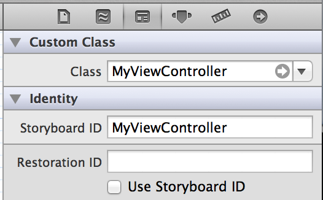

SWIFT STRINGS
===============
---

Week 2 - Day 3 - Lesson 1

BY: Eric Giannini 

---


# CONNECTION TO LONG-TERM OBJECTIVE

Working with Strings is a fundamental type in Swift, a struct but not a class; Strings are used throughout mobile apps. 

# LEARNING OBJECTIVES

* **Articulate** how Strings are stored

* **Manipulate** characters in Strings

* **Parse** words inside of a String

* **Iterate **through characters in a String

## STUDENT PRE-WORK

Students should be able to:

* arrays
* loops
* functions

# LESSON GUIDE

<table>
  <tr>
    <td>TIMING</td>
    <td>TYPE</td>
    <td>TOPIC</td>
  </tr>
  <tr>
    <td>10</td>
    <td>Opening</td>
    <td>Solve this problem</td>
  </tr>
  <tr>
    <td>15</td>
    <td>Introduction </td>
    <td>This is a String and what it is made of</td>
  </tr>
  <tr>
    <td>15 </td>
    <td>Demo</td>
    <td>Lets use that information to solve the opening problem</td>
  </tr>
  <tr>
    <td>20</td>
    <td>Independent Practice</td>
    <td>Write these functions</td>
  </tr>
  <tr>
    <td>5</td>
    <td>Conclusion</td>
    <td>Key takeaways</td>
  </tr>
  <tr>
    <td>65</td>
    <td></td>
    <td></td>
  </tr>
</table>


# OPENING (10 mins)
What is a string? 

## PRACTICE PROBLEM

Write a function that takes a number represented as a String and converts it to an Int.

---


# INTRODUCTION: STRINGS (15 mins)

## STOP-AND-JOT

Why do you think we call them Strings?

## DEFINITION

"A String is a series of characters."

* Swift Reference

## WHO CARES

Strings are important. As constants String types play a key role in iOS development. A value for `kURL`, for instance, may be an example of how a String type is used to facilitate HTTP requests; A storyboard ID is a String type that you can use to create a new ViewController based on that storyboard's ViewController or for the sake of assigning a class to a scene in Interface Builder we use a String type. Here is an example of a real world application of the String type to iOS application development. 



``` 
@IBAction func buttonPressed(sender: AnyObject) {
    let vc = storyboard?.instantiateViewControllerWithIdentifier("MyViewController") as MyCustomViewController
    presentViewController(vc, animated: true, completion: nil)
}
```

## DEMONSTRATE

Explain how a String is conceptualized as an Array of Characters

What is Unicode? 

[http://unicode-table.com/en/#sinhala](http://unicode-table.com/en/#sinhala)

# DEMO (15 mins)

* Iterate through the String using a for loop.

* Iterate through the String using index 

* Solve the opening problem

* Splitting Strings

---


# INDEPENDENT PRACTICE (10 mins)

## PRACTICE PROBLEMS

Write a function that

* Take a String and returns the String with an emoji character appended to the original

* Take a String and returns a String with an emoji character prepended to the original

* Takes a String and returns a count of how many spaces are in the String

# PAIR-PROGRAMMING PRACTICE (15 mins)

## PRACTICE PROBLEMS

* Takes a String representing a sentence and returns a String with the words (not the characters) reversed

* Takes a String and prints it in all upper case

* Write  a function that takes a String and returns a new String with all instances of the Character ‘a’ with the character ‘o’.

* Write a function that prints all of the Unicode characters (advanced)

---


# CONCLUSION (5 mins)

## CHECK-FOR-UNDERSTANDING: WRITE-SHARE

*Write down what you think is the purpose of a String type.*

## TAKEAWAYS

* The structure reference for a String type reveals a `struct` with definite methods & properties for its manipulation as a data types; the String type is an Array of characters. 

* Most of what your users communicate to you will be through Strings: passwords, emails, numbers, names, etc.

## Further Reading 
[Strings & Characters](https://developer.apple.com/library/mac/documentation/Swift/Conceptual/Swift_Programming_Language/StringsAndCharacters.html#//apple_ref/doc/uid/TP40014097-CH7-ID285)

