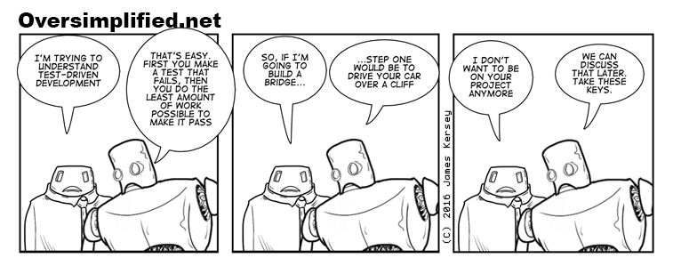

# How To: Test Driven Development (TDD) 👑 ✅

#### Modified by: Ella; 3/14/17

## What is it?

+ Philosophy of software development
	+ In response to the question "How much of our code should we test?" 
+ Concludes that writing tests after code makes the tests an afterthought
+ Write tests first!!

## Process

+ Add a new unit test
+ Run that test (command-U) & make sure it fails
+ Add some code to make the test pass

> Note: The philosophy calls for you to write the simplest code possible to make the test pass. However, I sometimes find this idea needlessly tedious.	

~~~swift
import Foundation

class Text {
	let value: String
	
	init(text: String) {
		self.value = text
	}
}
~~~

* In your test file:

~~~swift
@testable import YourAppName

func testTextSetsValueCorrectly() {
	// given
	let string = "Hello Richard"
	
	// when 
	let text = Text(text: string)
	
	// then
	XCTAssertEqual(text.value, string)
}

func testTextSetsValueToMultipleDifferentStrings() {
	// given
	let stringOne = "Hello"
	let stringTwo = "World"
	
	// when
	let textOne = Text(text: stringOne)
	let textTwo = Text(text: stringTwo)
	
	// then
	XCTAssertEqual(stringOne, stringOne)
	XCTAssertEqual(stringTwo, stringTwo)
}
~~~
 
+ Run tests again (command-U), the test should pass
+ Refactor code
+ Repeat 🔁

## Fun 

* Size classes: have to make checked installed for the orientation you want and unchecked installed for other orientations.