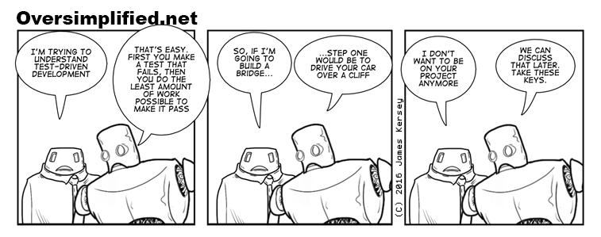

# How To: Test Driven Development (TDD) 👑 ✅

## What is it?

+ Philosophy of software development
	+ In response to the question "How much of our code should we test?" 
+ Concludes that writing tests after code makes the tests an afterthought
+ Write tests first!!

## Process

+ Add a new unit test
+ Run that test (command-U) & make sure it fails
+ Add some code to make the test pass

> Note: The philosophy calls for you to write the simplest code possible to make the test pass. However, I sometimes find this idea needlessly tedious.	
 
+ Run tests again (command-U), the test should pass
+ Refactor code
+ Repeat 🔁

## Fun 

